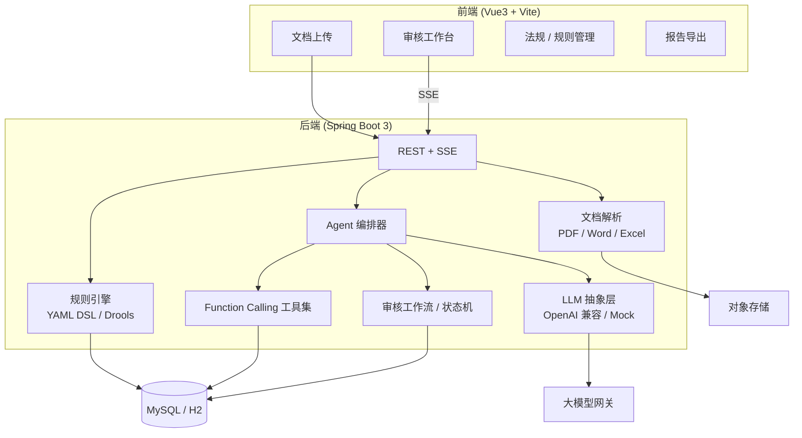

# 合规文档 AI 审核 Agent

> 面向内审 / 合规 / 法务场景的**文档智能审核系统**：**规则引擎硬校验** + **LLM 语义审查**双层把关，**Function Calling Agent** 自主调用法规检索、版本 diff、风险评分与报告生成，审核结论全链路留痕。一条 `docker compose` 命令即可拉起，**无需任何大模型密钥**也能完整体验 Mock 审核流程。

<p>
  
  
  
  
  
  
</p>

> **当前状态**：`0.1.0` 规划阶段 — README / 规格书已就绪，源码骨架待实现。完整设计见 [`docs/ai-portfolio/project-07-spec.md`](../docs/ai-portfolio/project-07-spec.md)。

---

## ✨ 项目亮点

- **规则引擎 + LLM 双层审核，而非纯 ChatGPT 读文档**：YAML 规则 DSL（或 Drools）先行校验必备条款、数值阈值、禁限关键词；规则无法覆盖的语义风险交由 LLM + Function Calling 深度审查，结论可解释、可复核。
- **8 个 Function Calling 工具**：法规检索、章节取文、规则包执行、版本 diff、实体抽取、风险评分、审核报告生成、整改任务创建 — Agent 决策过程 SSE 流式透明展示。
- **贴合内审合规场景**：合同 / 内控制度 / 信息披露等文档类型；审核工作流状态机（上传 → 机审 → 人工确认 → 整改闭环）；`audit_event` 全链路留痕。
- **Mock 优先体验**：内置 Mock 法规库 + Mock LLM，无 API Key 可跑通「上传 → 规则命中 → 语义发现 → 报告预览」完整链路。
- **可插拔多模型**：OpenAI 兼容接口，`DeepSeek / 通义 / Ollama` 环境变量一键切换。
- **工程化规划**：清晰分层（document / rule / agent / review / workflow），JUnit 覆盖规则命中、工具路由、状态机。

## 🏗️ 系统架构



> 详细时序图、数据模型与 API 设计见 [`docs/ai-portfolio/project-07-spec.md`](../docs/ai-portfolio/project-07-spec.md)。

## 🧰 技术栈

| 层 | 选型 |
| --- | --- |
| 后端 | Java 17、Spring Boot 3.5、Spring MVC（SSE） |
| 规则引擎 | YAML DSL（MVP）/ Drools 7.x（可选） |
| 文档解析 | Apache PDFBox、Apache POI |
| Agent | 自研工具注册中心 + Function Calling 编排 |
| 大模型 | OpenAI 兼容客户端（流式 + 工具调用）/ 内置 Mock |
| 持久层 | MyBatis-Plus 3.5、MySQL 8（生产）/ H2（本地） |
| 前端 | Vue 3、Vite、TypeScript |
| 部署 | Docker、docker-compose |

## 📁 目录结构（规划）

```
compliance-doc-agent/
├── backend/                          # Spring Boot 3 后端（待建）
│   ├── src/main/java/com/portfolio/compliance/
│   │   ├── agent/          # Agent 编排 + 8 个 Function Calling 工具
│   │   ├── rule/           # 规则引擎：YAML DSL 解析与执行
│   │   ├── document/       # 上传、解析、分块、版本管理
│   │   ├── review/         # 审核流水线、发现项聚合
│   │   ├── workflow/       # 状态机、audit_event
│   │   ├── regulation/     # 法规 / 内规 CRUD + 检索
│   │   ├── report/         # 审核报告生成
│   │   └── llm/            # LLM 抽象层
│   └── src/main/resources/rules/     # 内置 Mock 规则包
├── frontend/                         # Vue3 审核工作台（待建）
├── docs/
│   └── architecture.md               # 架构文档（待建）
├── docker-compose.yml                # 待建
├── .env.example                      # 待建
├── VERSION
├── CHANGELOG.md
└── README.md
```

## 🚀 快速开始

> **注意**：源码骨架尚未实现。以下为规划中的启动方式，实现后可直接使用。

### Docker 一键启动（推荐）

```bash
cd compliance-doc-agent
cp .env.example .env        # 默认 Mock 模型即可体验
docker compose up -d --build
```

启动后（规划端口）：

- 前端界面： http://localhost:8080
- 后端接口： http://localhost:8081/api/health

体验流程：

1. 上传内置样例合同 → 观察规则引擎命中「缺失争议解决条款」等发现项；
2. 查看 LLM 语义审查产出的隐性风险建议；
3. 在 Agent 对话中追问「列出所有 HIGH 风险项」→ 观察 `calculate_risk_score` 工具调用；
4. 导出审核报告 PDF / Word。

### 本地开发

```bash
cd backend
mvn spring-boot:run           # 默认 H2 + Mock LLM

cd frontend
npm install && npm run dev    # http://localhost:5173
```

## ⚙️ 配置说明（规划）

| 变量 | 说明 | 默认 |
| --- | --- | --- |
| `LLM_PROVIDER` | `mock` / `openai` | `mock` |
| `LLM_BASE_URL` | OpenAI 兼容网关 | `https://api.openai.com/v1` |
| `LLM_MODEL` | 模型名 | `deepseek-chat` |
| `LLM_API_KEY` | 密钥（留空回退 Mock） | 空 |
| `SPRING_PROFILES_ACTIVE` | `mysql` 启用 MySQL | 空（H2） |
| `STORAGE_TYPE` | `local` / `minio` | `local` |
| `RAG_ENABLED` | 是否启用法规向量检索 | `false` |

## 🔌 API 概览（规划）

| 方法 | 路径 | 说明 |
| --- | --- | --- |
| POST | `/api/documents/upload` | 上传文档，触发审核流水线 |
| GET | `/api/documents/{id}/findings` | 发现项列表 |
| GET | `/api/review-tasks/{id}/stream` | SSE：审核进度 + Agent 事件 |
| POST | `/api/chat/sessions/{id}/messages` | SSE 流式 Agent 对话 |
| GET | `/api/documents/{id}/compare` | 版本 diff |
| GET | `/api/reports/{taskId}` | 导出审核报告 |
| CRUD | `/api/regulations/**` | 法规库管理 |
| CRUD | `/api/rule-packs/**` | 规则包管理 |

## 🧠 Agent 工具一览

| 工具名 | 用途 | 关键参数 |
| --- | --- | --- |
| `search_regulation` | 检索法规 / 内规库 | `keyword`, `category` |
| `get_document_section` | 按章节 / 页码取原文 | `docId`, `sectionId` |
| `run_rule_pack` | 执行规则包 | `docId`, `rulePackId` |
| `compare_document_versions` | 版本 diff | `docId`, `baseVersion`, `targetVersion` |
| `extract_entities` | 抽取甲乙方、金额、日期等 | `docId` |
| `calculate_risk_score` | 汇总风险评分 | `docId`, `findingIds` |
| `generate_audit_report` | 生成审核报告 | `docId`, `format` |
| `create_remediation_task` | 创建整改任务 | `docId`, `findingId`, `assignee` |

## 📋 审核工作流

```
UPLOADED → PARSING → RULE_REVIEW → LLM_REVIEW → PENDING_CONFIRM
    → APPROVED / REJECTED → REMEDIATION → 重新上传 → ARCHIVED
```

非法状态流转会被拒绝；每次变更写入 `audit_event` 满足内审留痕。

## 🗺️ Roadmap

### Phase 1 — MVP

- [ ] 文档上传 + PDF/Word 解析 + 分块
- [ ] YAML 规则 DSL + 10 条内置合同规则
- [ ] Mock LLM 语义审查
- [ ] 审核工作台（原文 + 发现项）
- [ ] Docker Compose 一键启动

### Phase 2 — Agent 增强

- [ ] 8 个 Function Calling 工具全部实现
- [ ] Agent 对话追问（SSE + 工具可视化）
- [ ] 版本 diff + 审核报告 PDF 导出
- [ ] 接入真实 LLM

### Phase 3 — 生产化

- [ ] 法规库向量检索（对接 Enterprise RAG）
- [ ] Drools 复杂规则 + RBAC 多租户
- [ ] 整改任务闭环 + 看板统计

## 🔗 相关项目

| 项目 | 关系 |
| --- | --- |
| [AI Service Agent](../ai-service-agent/) | Agent 编排与 Function Calling 参考实现 |
| [Enterprise RAG](../enterprise-rag/) | 法规知识库向量检索（可选集成） |
| [AI Portfolio](../ai-portfolio/) | 作品集总览 |
| [Project 07 规格书](../docs/ai-portfolio/project-07-spec.md) | 完整设计文档 |

## 📄 许可证

本项目基于 [MIT License](LICENSE) 开源。内置法规条文与样例文档均为虚构，仅用于演示。
