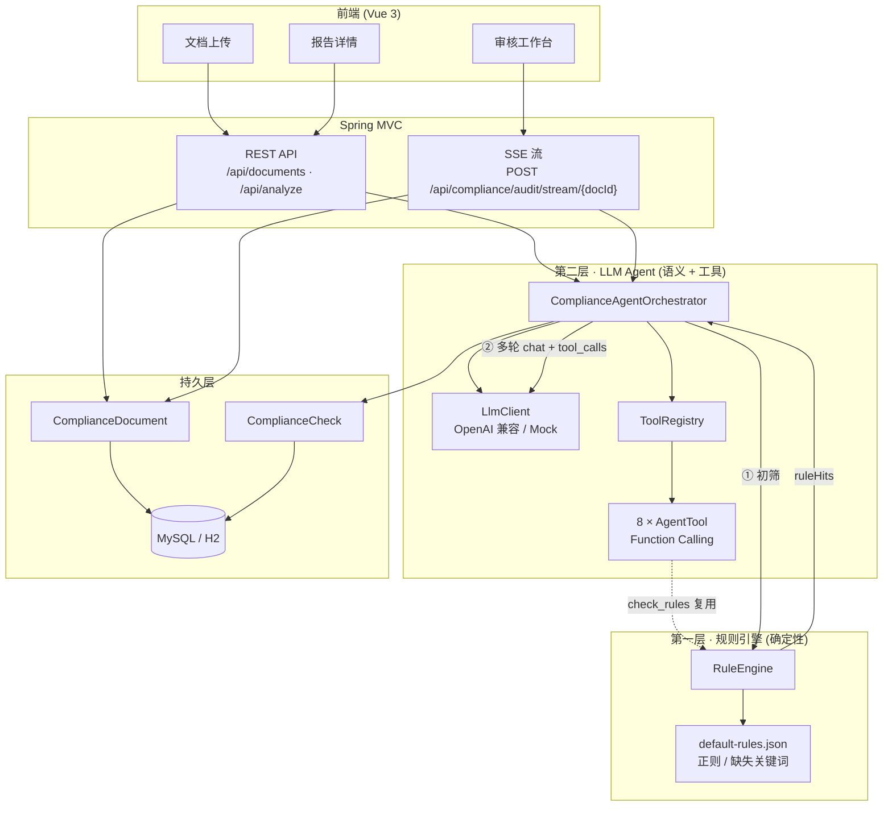
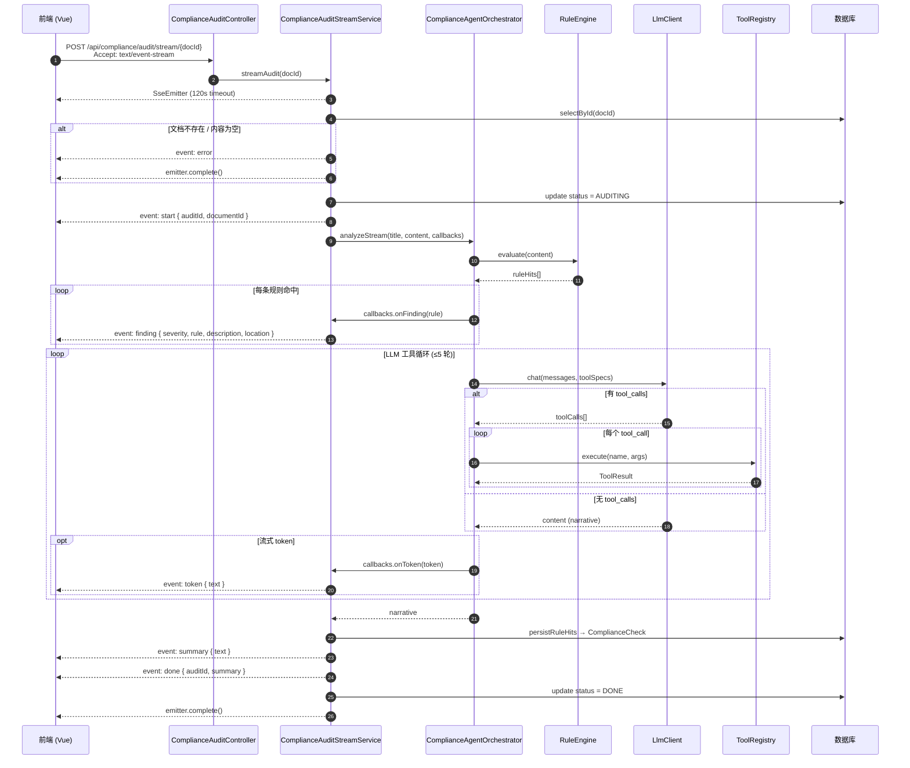

# compliance-doc-agent 系统架构

> 面向内审 / 合规 / 法务场景的文档智能审核系统：**规则引擎硬校验** + **LLM Agent 语义审查**双层把关，Function Calling 工具链驱动深度分析，SSE 流式推送审核进度。

| 字段 | 内容 |
| --- | --- |
| 项目 | `compliance-doc-agent` |
| 后端 | Java 17 + Spring Boot 3 |
| 前端 | Vue 3 + Vite + TypeScript |
| 更新 | 2026-07-04 |

---

## 1. 双层审核架构总览

系统采用 **规则层（确定性）** 与 **Agent 层（语义 + 工具）** 协作的双层架构：

- **规则层**：加载 `rules/default-rules.json`，基于正则 / 关键词对全文做初筛，输出结构化 `ComplianceRule` 命中项，保证底线合规、可解释、可单测。
- **Agent 层**：`ComplianceAgentOrchestrator` 将规则初筛结果注入 LLM 上下文，通过 Function Calling 自主调用 8 个工具（法规检索、条款对比、风险汇总等），最多 5 轮工具循环，产出 `ComplianceFinding` 与 narrative 摘要。



### 1.1 审核数据流

| 阶段 | 组件 | 输入 | 输出 |
| --- | --- | --- | --- |
| ① 规则初筛 | `RuleEngine.evaluate()` | 文档正文 | `List<ComplianceRule>` |
| ② Prompt 组装 | `ComplianceAgentOrchestrator` | 标题 + 正文 + 规则摘要 | `ChatMsg` 消息链 |
| ③ 工具循环 | `ToolRegistry.execute()` | LLM `tool_calls` | `ToolResult` → `ComplianceFinding` |
| ④ 结果聚合 | Orchestrator | ruleHits + findings + toolTrace | `AgentAnalysisResult` |
| ⑤ 持久化 | `ComplianceCheckMapper` | 规则命中 | DB 留痕 |

### 1.2 核心类职责

| 类 | 包路径 | 职责 |
| --- | --- | --- |
| `RuleEngine` | `rules` | 加载 JSON 规则包，正则匹配 / 缺失关键词检测 |
| `ComplianceAgentOrchestrator` | `agent` | 规则初筛 + LLM 多轮工具编排（`MAX_TOOL_ROUNDS = 5`） |
| `ToolRegistry` | `agent.tool` | 聚合 8 个 `AgentTool`，提供 Schema 与按名执行 |
| `ComplianceAgentToolStubs` | `agent.tool.stub` | Mock 模式下的 8 工具实现 |
| `ComplianceAuditStreamService` | `service` | SSE 流式审核，推送 finding / token / summary |
| `ComplianceAnalysisService` | `service` | 同步 REST 分析入口 |

---

## 2. SSE 流式审核时序

前端通过 `POST /api/compliance/audit/stream/{documentId}` 发起审核，后端以 **Server-Sent Events** 推送进度。事件顺序：`start` → `finding*` → `token*` → `summary` → `done`（异常时 `error`）。



### 2.1 SSE 事件契约

| 事件名 | 触发时机 | Payload 字段 |
| --- | --- | --- |
| `start` | 审核开始 | `auditId`, `documentId` |
| `finding` | 规则引擎命中 | `severity`, `rule`, `description`, `location` |
| `token` | LLM 流式输出片段 | `text` |
| `summary` | 审核摘要 | `text` |
| `done` | 审核完成 | `auditId`, `summary` |
| `error` | 异常 / 校验失败 | `message` |

### 2.2 前端消费

`frontend/src/api.ts` 中 `streamAudit()` 使用 `fetch` + `ReadableStream` 解析 SSE 帧，按 `event:` / `data:` 行分发至 `onEvent` 回调。

---

## 3. Function Calling 工具表（8 个）

所有工具通过 `ToolRegistry` 注册，LLM 以 OpenAI Function Calling 格式调用。Mock 模式下由 `ComplianceAgentToolStubs` 返回结构化 stub 数据。

| # | 工具名 | 说明 | 必填参数 | 主要返回 |
| --- | --- | --- | --- | --- |
| 1 | `check_rules` | 对文档正文执行规则包硬校验，返回结构化命中项 | `doc_content` | `findings[]`, `count` |
| 2 | `compare_clause` | 对比两个版本文档的指定条款差异 | `doc_id`, `clause_ref` | 条款 diff findings |
| 3 | `summarize_risks` | 汇总发现项并计算综合风险等级 | `doc_id` | `riskScore`, `riskLevel`, `summary` |
| 4 | `search_regulation` | 检索法规 / 内规库中的相关条文 | `keyword` | `regulations[]` |
| 5 | `get_document_section` | 按章节或页码获取文档原文片段 | `doc_id` | `sectionId`, `text`, `pageNo` |
| 6 | `extract_entities` | 从文档中抽取甲乙方、金额、日期等关键实体 | `doc_id` | `partyA`, `partyB`, `amount`, … |
| 7 | `generate_audit_report` | 生成审核报告（PDF / Word / Markdown） | `doc_id`, `format` | `reportId`, `url`, `status` |
| 8 | `create_remediation_task` | 为指定发现项创建整改任务 | `doc_id`, `finding_id` | `taskId`, `status`, `assignee` |

### 3.1 工具与规则引擎的关系

- `check_rules` 内部直接调用 `RuleEngine.evaluate()`，与 Orchestrator 启动时的初筛逻辑一致，允许 Agent 在对话中**按需复验**。
- 其余 7 个工具当前为 Mock stub，生产环境可替换为真实法规库、文档存储、工单系统集成。

### 3.2 Agent 工具循环

```text
for round in 0..MAX_TOOL_ROUNDS-1:
    request = LlmChatRequest(messages, toolSpecs)
    request.allowTools = (round < MAX_TOOL_ROUNDS - 1)
    result = llm.chat(request)

    if not result.hasToolCalls():
        return AgentAnalysisResult(...)

    messages += assistantToolCalls(result.toolCalls)
    for call in result.toolCalls:
        args = parseArgs(call.arguments)
        args.setdefault("doc_content", content)
        args.setdefault("doc_title", title)
        tr = toolRegistry.execute(call.name, args)
        collectFindings(tr, findings)
        messages += tool(call.id, call.name, tr.summary)
```

---

## 4. 规则引擎设计

规则包位于 `backend/src/main/resources/rules/default-rules.json`，启动时由 `RuleEngine` 加载为内存 `LoadedRule` 列表。

| 机制 | 说明 |
| --- | --- |
| 正则命中 | `pattern.matcher(content).find()` → 生成 WARNING / ERROR |
| 缺失关键词 | 规则名含「缺失」时，**未匹配** pattern 即命中 |
| 空文档 | 固定返回 `EMPTY_CONTENT` / ERROR |
| 严重度映射 | JSON `HIGH` → ERROR，`LOW` → INFO，其余 → WARNING |

内置规则示例：`R-CON-001` 缺失争议解决条款、`R-CON-003` 禁止无限连带责任、`R-CON-004` 违约金比例过高等。

---

## 5. 部署与扩展

```text
compliance-doc-agent/
├── backend/
│   └── src/main/java/com/portfolio/compliance/
│       ├── agent/           # Orchestrator、Finding、AuditStreamCallbacks
│       ├── agent/tool/      # ToolRegistry、AgentTool、ToolNames
│       ├── rules/           # RuleEngine、ComplianceRule
│       ├── llm/             # LlmClient、ToolSpec、Mock
│       ├── service/         # Analysis + SSE Stream
│       └── controller/      # REST + SSE 入口
├── frontend/src/
│   ├── api.ts               # REST + streamAudit SSE 客户端
│   └── views/               # UploadView、ReportView
└── docs/
    ├── architecture.md      ← 本文件
    └── ai-portfolio/project-07-spec.md
```

| 扩展点 | 方式 |
| --- | --- |
| 新增规则 | 编辑 `default-rules.json` 或后续 CRUD API |
| 新增工具 | 实现 `AgentTool` 接口并注册为 Spring `@Bean` |
| 切换 LLM | 环境变量 `LLM_PROVIDER` / `LLM_BASE_URL` / `LLM_API_KEY` |
| 真实法规检索 | 替换 `SearchRegulationTool` stub 为向量库 / ES 实现 |

---

## 6. 相关文档

- [MVP 规格书](./ai-portfolio/project-07-spec.md) — 数据模型、API 清单、验收标准
- [使用说明](./USAGE.md)
- [README](../README.md) — 快速启动与 Docker Compose
